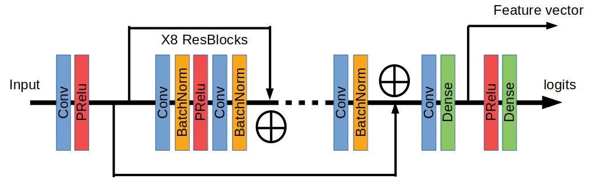

# animal_classifier

### Network Architecture
* **network.py** contains the network architecture



### Loss Function
* Softmax crossentropy with centre loss was used as loss function

### Training
* config.ini contains all the parameters and data paths for training. You can change the parameters here
* To start training run **main.py** in the command line
```console
foo@bar:~$ python -m main
```

### Testing
* To test on a single image run the following command in terminal
```console
foo@bar:~$ python -m test /path/to/image
```

### Miscellaneous
* Tensorflow models can be found in the **model** folder
* The network was trained for 100 epochs
* **logger.log** contains the following record for every epoch
    - iteration number
    - epoch
    - train loss
    - test accuracy
* **requirements.txt** contains the version of the modules which I used

##### Please do not hesitate to get in touch with me if you need any clarification.
